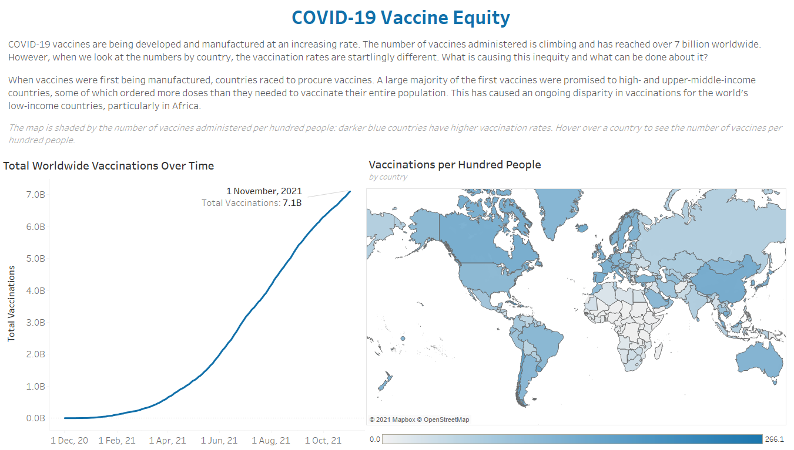
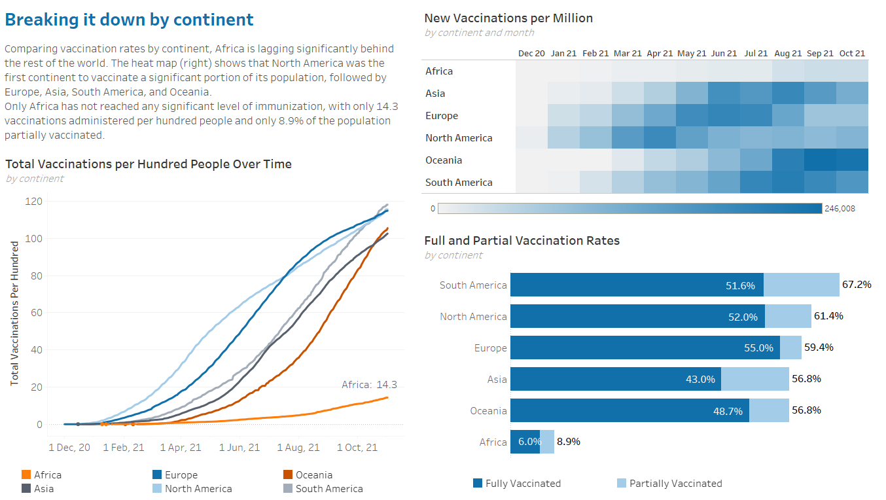
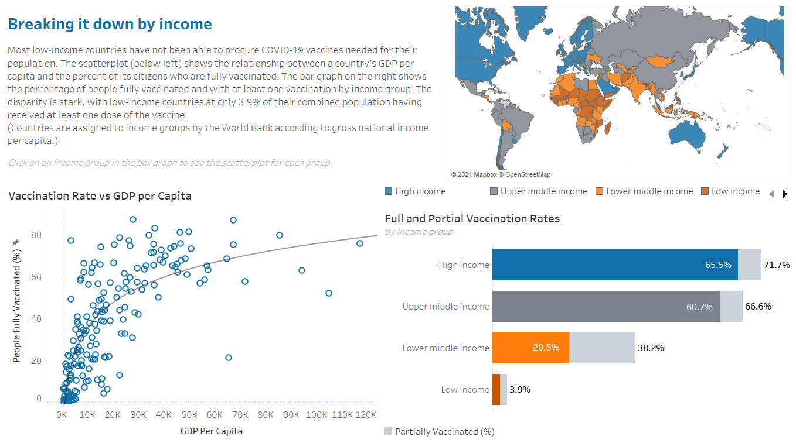
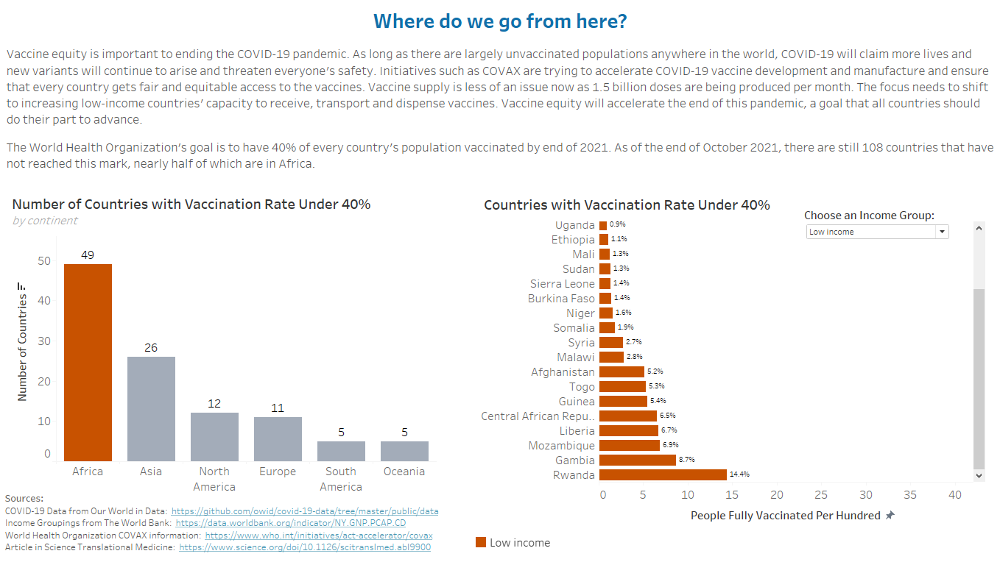

# COVID-19 Vaccine Equity Project

## Introduction

This project looks at COVID-19 vaccination rates around the world, as of November 1, 2021.

I used a [COVID-19 Dataset](https://github.com/owid/covid-19-data/tree/master/public/data) from Our World in Data. This dataset included daily numbers for each country, continent, and worldwide for the following measures:
- Total vaccinations
- Total vaccinations per hundred people
- People vaccinated
- People vaccinated per hundred
- People fully vaccinated
- People fully vaccinated per hundred
- New vaccinations (smoothed)
- New vaccinations per million (smoothed)
- Population
- GDP per capita

I also joined data from the World Bank on the [income groupings](https://data.worldbank.org/indicator/NY.GNP.PCAP.CD), which classifies countries into one of the following income levels based on the country’s gross national income per capita: high income, upper middle income, lower middle income, or low income.

**Other Sources:**

- [COVAX information](https://www.who.int/initiatives/act-accelerator/covax) from the World Health Organization
- [Article: “No One is Safe Until We Are All Safe”](https://www.science.org/doi/10.1126/scitranslmed.abl9900) in Science Translational Medicine

### Question:
What portions of the world population are most affected by COVID-19 vaccine inequity?

**Hypothesis:** I suspect that lower income countries are being disproportionately affected. 

## Process & Challenges

In addition to the vaccination information, the original dataset also had data for many other COVID-19 measures, including testing, positivity rate, confirmed cases, confirmed deaths, hospitalizations and ICU, reproduction rate, and policy responses. It also included other information about each country, such as the population density, percent of population living in extreme poverty, handwashing facilities, and life expectancy. I spent a good portion of time exploring the data to decide what story I wanted to tell and what measures were needed to do so. I removed many unnecessary columns before connecting the Excel spreadsheet to Tableau.

I used Tableau to explore my hypothesis about COVID-19 vaccine inequity. I loaded two datasets into Tableau (the pared-down COVID-19 data and the country income group data) and made a relationship between them on the country code.

I divided my exploratory data analysis into four parts: 
Worldwide vaccinations
Vaccinations by continent
Vaccinations by country income levels
Countries with low vaccination rates (less than 40%)

####Tableau Features Used:
- I created overlapping bar graphs of full and partial vaccination rates by putting both measures in the columns and making a dual axis with the same fixed start and end values.
- The biggest challenge in this project was the overlapping bar graph showing the full and partial vaccination rates by income level. Unlike the continents, which had aggregated numbers in the original dataset, I had to figure out how to get the vaccination rates for each income group from the most recent vaccination numbers and the population of each country. To make it work, I used calculated fields with level-of-detail calculations (for example, {FIXED[Location]:MAX([People Fully Vaccinated])}).
- I made a set of countries with vaccination rates less than 40% and used it as a filter to explore countries with low vaccination rates.
- I incorporated interactivity on two of the dashboards. For vaccinations by income group, I created an action where the user can click on an income group on the bar graph to filter the world map and scatterplot for each group. I also made a dropdown menu where the user can choose an income level to see a bar graph of all the countries in that income group with vaccination rates less than 40%.

## Solutions & Analysis

(Explore the interactive Tableau Story [here](https://public.tableau.com/app/profile/lorien.mccomb/viz/Covid-19VaccineEquity/VaccinesStory).)

###1. Worldwide Vaccinations

COVID-19 vaccines are being developed and manufactured at an increasing rate. The number of vaccines administered is climbing and has reached over 7 billion worldwide. **However, when we look at the numbers by country, the vaccination rates are startlingly different.** A quick look at the world map coloured by vaccination rates shows that there is a stark disparity in Africa.

###2. Vaccinations by Continent

Digging into the vaccination rates by continent, I found that **Africa is lagging significantly behind the rest of the world**. While every other continent has administered more than one vaccination per person, Africa has only given 14.3 vaccinations per hundred people. Only 8.9% of Africans have been at least partially vaccinated, while on every other continent over half the population has been partially vaccinated. 

The heat map in the top right tells the story over time: The dark blue sections show when a high rate of new vaccinations occur. North America was the first continent to vaccinate a significant portion of its population, followed by Europe, Asia, South America, and Oceania. The only continent with no dark blue patch on the heat map is Africa, meaning it has had no significant period of vaccinations.

###3. Vaccinations by Country Income Level

The vaccine disparity comes into even sharper focus when we look at the vaccine rates by country income level. The scatterplot shows a roughly logarithmic relationship between a country’s GDP per capita and its COVID-19 vaccination rate: in general, the higher a country’s GDP per capita, the more of its citizens are vaccinated.

Grouping countries by income levels (based on gross national income per capita) tells the same story (see the bar graph): Over two-thirds of people living in high- and upper-middle-income countries have received at least one dose of the vaccine, but in low-income countries the rate is only 3.9%.

This dashboard includes interactive features where the user can click on an income group on the bar graph to see the countries on the world map and the scatterplot for each group. To explore, go to the [dashboard](https://public.tableau.com/app/profile/lorien.mccomb/viz/Covid-19VaccineEquity/VaccinesStory) on Tableau Public.

###4. Countries with Low Vaccination Rates

The World Health Organization's goal is to have 40% of every country’s population vaccinated by the end of 2021. On this dashboard, I explored the countries that had not met this goal by the end of October 2021. Of the 108 countries with less than 40% of their population vaccinated, 49 of them are in Africa. The interactive bar chart (see [Tableau Public](https://public.tableau.com/app/profile/lorien.mccomb/viz/Covid-19VaccineEquity/VaccinesStory)) allows the user to see the countries in each income group that have low vaccination rates. It is worth noting how very low the vaccination rates are in low-income countries.

### Recommendations
Vaccine equity is important to ending the COVID-19 pandemic. As long as there are largely unvaccinated populations anywhere in the world, COVID-19 will claim more lives and new variants will continue to emerge. We have seen how fast new variants spread around the world and threaten everyone’s safety. *(Note: This project was completed before the rise of the Omicron variant, which originated in Africa.)* 

COVID-19 vaccines are being manufactured more quickly now than they were earlier in 2021, so vaccine supply is less of an issue. The focus now needs to shift to increasing low-income countries' capacity to receive, transport and dispense vaccines. Initiatives such as COVAX are trying to accelerate COVID-19 vaccine development and manufacture and ensure that every country gets fair and equitable access to the vaccines. While high-income countries are now vaccinating children and giving third doses to adults, I would encourage a broader worldwide approach to ensure that all people can access vaccines. This will limit the rise of new COVID-19 variants and accelerate the end of the pandemic. In a very real sense, no one is safe until we are *all* safe.
